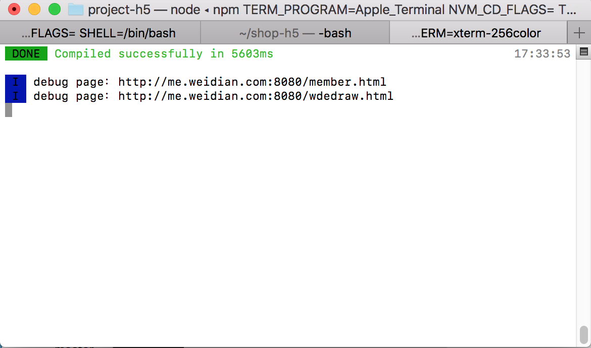
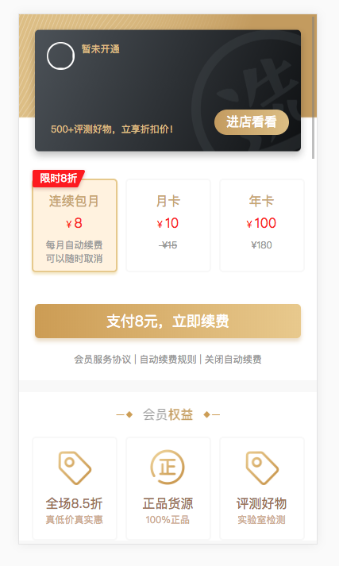

# multiple-pages

项目介绍：
   这是一个多页面H5项目模板，需要配合fx-cli使用，使用的技术 vue + webpack

   项目搭建以及性能优化上与vue-cli相似：

   1：会给静态资源加上hash值，默认使用强缓存即可。

   2：将公用的库抽成vender.js

   3：将每个页面的css抽成一个文件

   4：开启css以及js压缩

   5：使用preload-webpack-plugin插件，将必须的js提前下载

   6：移动端适配使用的是rem布局方式，技术实现使用淘宝出品的移动端自适应方案（lib-flexible）

   7：引用只包含运行时的vue版本（vue.runtime.esm.js），vue的体积可以缩小30% ，在index.js中需要使用render函数
   的形式注入

   8:sass-resources-loader这个loader在引入全局变量时，注意只注入函数和变量。
   
   9：引入图片压缩loader

 本项目一共四套环境，可以去package.json中查看。

 项目中引入了postcss-pxtorem，所以开发时单位直接写px就可以，打包时这个loader会将px直接转成rem

 本地开发多页面引用与单页面一样，项目会将将多页面的访问地址输出到终端，直接访问即可，
 
 
                                              

 具体开发方式可以查看demo
 例子：

 

## Build Setup

npm install

开发环境
npm run dev

线上环境
npm run prod

生成包分析
npm run analyz

